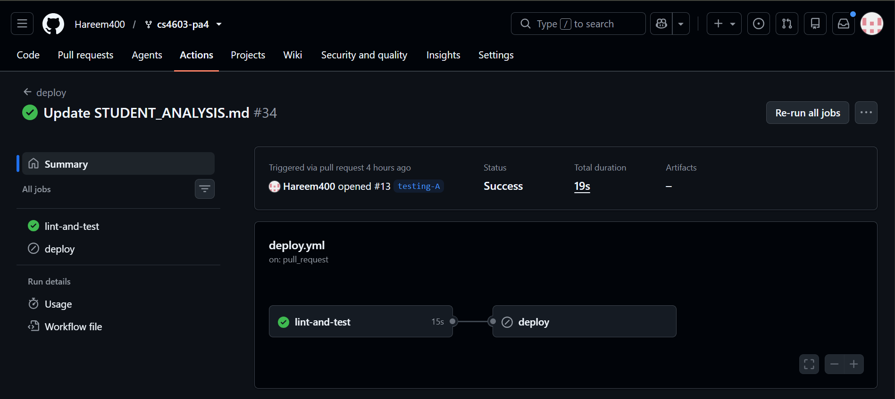
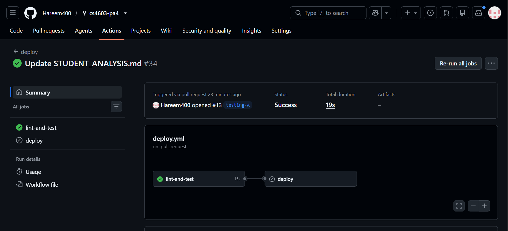
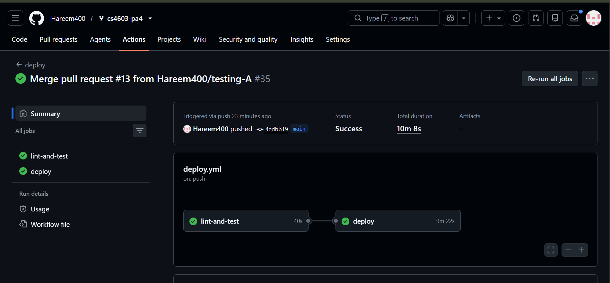
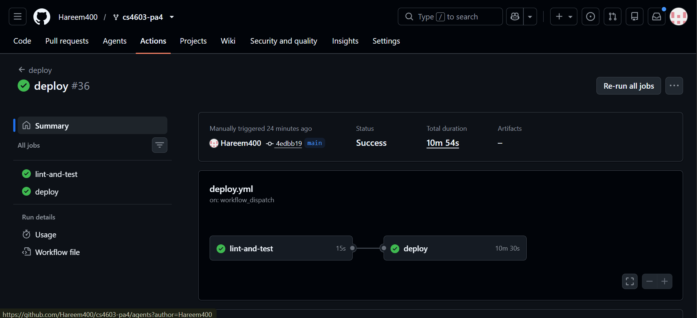
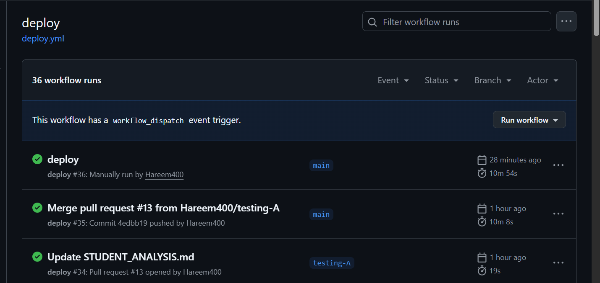

# CS4603 PA4 — Document Analyst (Student Submission)

> This is your **submission file**. `README.md` is the assignment spec — this document is where you write up your work.
>
> - Document how to set up, run, and deploy your Document Analyst so a TA can reproduce your results.
> - **Answer every ANALYSIS QUESTION** from the assignment in the sections below.
> - Replace every `TODO` before submitting.
> - Keep it self-contained: a reader should be able to follow this file top-to-bottom —
>   setup → ingest → run → deploy → results — without opening the assignment spec.

## Setup

```bash
uv sync
cp .env.example .env   # then fill in your values
```

## Running locally

TODO: how to ingest the corpus, run the graph in `pa4.ipynb`, and test queries.

> **Example of the level of detail expected** (replace with your own steps/values):
>
> 1. **Ingest the corpus** (run once, from a Databricks notebook):
>    ```python
>    from rag.ingest import ingest
>    ingest(spark, volume_path="/Volumes/main/default/pa4/annual_report.pdf")
>    ```
>    This parses the PDF, chunks it into `main.default.ali_analyst_chunks`, and syncs the
>    Vector Search index `main.default.ali_analyst_index`. Wait until the index is `READY`.
>
> 2. **Build and run the graph** in `pa4.ipynb`:
>    ```python
>    from agent.graph import build_graph
>    graph = build_graph()          # uses config.py + rag/store.py + the MCP server
>    result = graph.invoke({"messages": [{"role": "user",
>              "content": "What was the net revenue in 2023?"}]})
>    print(result["messages"][-1].content)
>    ```
>
> 3. **Test queries I ran** (retrieval-only, computation-only, combined):
>    | Query | Answer produced |
>    |-------|-----------------|
>    | "What was the net income in 2023?" | ¥1.11 trillion [source: annual_report.pdf, p.4] |
>    | "What is 15% of 2.4 billion?" | 360 million |
>    | "What was 2023 revenue, and its value after 10% growth?" | ¥16.91T → ¥18.60T (16.91 × 1.10) |

## Deployment

TODO: how you logged, registered, and served the model; endpoint name; URL.

## Design decisions

TODO: graph architecture, routing, deployment choices.

---

## Analysis Questions

> Answer in your own words. Each question is copied from the assignment so you don't have to flip back.

### Task 1.2 — Planner
1. What happens when the planner produces steps that depend on each other (e.g., step 3 needs the result of step 1)? How does your architecture handle this?
   - This architecture doesn't pass structured values between steps: it passes step_results as a flat list of strings to the synthesizer at the end. So this case is handled implicitly: the RAG/MCP agent executing step 3 only sees the step text itself (e.g. Calculate 8% growth on the FY2023 revenue found in step 1), not the actual number. It relies on the LLM re-reading the fact from context if it's in scope, or more precisely, the MCP tool step's LLM call needs step_results so far to fill in the actual number. You'll want to make sure your mcp_tools node passes step_results into its prompt context, not just the current step string.
2. Would a replanning step after each execution improve or hurt performance for this use case? Justify with an example.
   - For this architeture it would mostly hurt as  it adds latency and cost without much upside, for a task where plans are usually short (2-5 steps) and low-ambiguity once you're past the first LLM call. But it could help in a case where for example the plan is 
   1. "Find Meridian's total R&D spend across all reported years"
   2. "Calculate what percentage of FY2023 revenue that represents"

If the rag_agent in step 1 returns "not found in documents", the original plan's step 2 is now based on a premise that doesn't hold (there's no "all years" figure to compute a percentage of). Without replanning, the mcp_tools step blindly tries to compute a percentage from whatever partial fact it's handed, and the synthesizer has to paper over a broken chain of reasoning. 

### Task 1.3 — Supervisor
1. Your supervisor makes a routing decision per step. What is the failure mode if it misroutes? How would you detect and recover from a misroute?
   - If a calculation step gets sent to the RAG agent, it comes back "not found" since that answer was never going to be in the document. If a lookup step gets sent to MCP tools instead, there's no document text to work with, so it either hallucinates a fake expression or errors out. Either way, a bad result lands in step_results, current_step_index still moves forward, and the synthesizer ends up building an answer around a hole it has no way of knowing was caused by routing rather than by the document actually missing that fact.
   - Detection has two levels here. Hard failures (the LLM call itself breaking) are already caught.The try/except falls back to keyword routing. The trickier case is a confident but wrong routing decision, and the best signal for that is downstream: a lookup step that comes back "not found" is a decent hint that it might've actually been a math step that got misrouted, since a well-scoped corpus rarely fails a genuine lookup.
   - Recovery-wise, the simplest fix is letting the supervisor re-route that same step to the other specialist once if it comes back empty or errors, instead of just advancing past it. Cap it at one retry so it can't loop forever.

2. Compare this supervisor pattern with a single ReAct agent that has access to all tools. When is the supervisor pattern worth the added complexity?
   - A ReAct agent with everything bound to it just thinks, calls whatever tool seems right, observes, and repeats until it decides it's done — no explicit plan, no supervisor. That's simpler to build and fine for a lot of tasks.
   - The supervisor pattern is worth it here for three reasons: you get an actual plan up front that you can inspect before anything runs, instead of reconstructing intent after the fact from a messy trace; the RAG prompt and the tool-calling prompt never have to share the same context window, so each stays focused instead of one agent juggling two different jobs at once; and because routing happens at clean, fixed step boundaries rather than an open-ended loop, it's much easier to bolt on retries, logging, or timeouts.
   - It's overkill for something simple like "what's 2+2" — that's three extra LLM calls (planner, supervisor, synthesizer) for a question a bare ReAct agent answers in one shot.

### Task 1.4 — RAG Agent
1. The RAG agent retrieves for a single decomposed step, not the full user query. How does this affect retrieval quality compared to retrieving for the original question?
   - Mostly a win. A step like "Find Meridian's net revenue for fiscal year 2023" is a much cleaner embedding target than the full original question, which often bundles a lookup and a calculation together ("what was the revenue in 2023, and what would it be after 8% growth for 3 years"). The second half is pure noise for a similarity search, since no chunk in the document is *about* compound growth math. Embedding the whole question risks pulling in chunks that superficially relate to growth as a concept rather than the actual revenue figure. 
   - The risk is the opposite direction: if a step is too narrowly or awkwardly worded (something the planner phrased more for the LLM's benefit than for embedding similarity), it can retrieve worse than the original question would have, since the original question at least contains all the user's original vocabulary. It really comes down to how well-formed the planner's step text is.
2. If the planner produces a vague step like "find relevant financial data," how would you improve the retrieval query before sending it to the vector store?
   - I'd rewrite the step into something more specific before it hits the retriever, rather than embedding it as-is. A couple of ways to do that: have the RAG agent's own LLM call expand the vague step into a more targeted query using the original question as context (so "find relevant financial data" plus "...for the growth calculation" becomes something like "Meridian net revenue fiscal year 2023"), or just run retrieval with a larger k and let the extraction prompt sift through more candidates instead of trusting a narrow top-k on a fuzzy query.
   - Longer term, this is really a planner problem. A stricter planner prompt that requires every lookup step to name the specific metric it needs (revenue, R&D spend, operating margin, etc.) instead of allowing generic phrasing would prevent this at the source rather than patching it downstream in the RAG agent.

### Task 2.1 — Model Definition
1. Why does `models-from-code` require a self-contained file? What breaks if you reference external state (e.g., a database running only on your laptop)?

MLflow re-executes this file inside the serving container, on a different machine than the one that logged it. That container can't see your laptop's filesystem, network, or local processes: only what's explicitly packaged via `code_paths` or passed as env vars/secrets. Reference a local DB or file path and the container tries to reach its own localhost or a path that was never copied over, and fails at startup. The underlying goal is reproducibility: any registered version should behave identically regardless of who loads it or when.

2. Your model calls a managed Vector Search index at inference time rather than embedding documents into the container image. What are the tradeoffs (freshness, cold-start size, latency, failure modes) of querying an external index vs. baking the corpus into the model artifact?
   - **Freshness:** live index means re-syncing the source data updates every deployed version automatically, no redeploy needed. Baked-in corpus is frozen at log time.
   - **Cold-start size:** current setup ships only code, so containers start fast. Baking in a corpus means shipping potentially gigabytes inside the artifact, slowing upload and cold starts.
   - **Latency:** flips the other way: baked-in is a local lookup (fast); external index adds a network round-trip per query.
   - **Failure modes:** external index is one more thing that can fail independently of the container itself (index down/scaling → `rag_agent` fails even though the model's healthy). Baked-in has fewer moving parts but pays for it everywhere else above.
   

### Task 2.3 — Serving Endpoint
1. Why must you pass `DATABRICKS_TOKEN` as an environment variable to the endpoint, even though it's already authenticated to serve models?

- Two separate auth relationships: Databricks authenticates *inbound* calls to the endpoint; your model's own code needs credentials for its *outbound* calls (chat LLM, Vector Search, MCP subprocess). Nothing about being "a Databricks model" auto-authenticates those internal calls — `config.get_chat_llm()` and `rag/store.get_retriever()` explicitly build clients from `DATABRICKS_HOST`/`DATABRICKS_TOKEN`, so without passing it in, those calls have no credentials.


2. What happens to in-flight requests when you deploy a new model version to the same endpoint? How does Databricks handle the transition?
 
 Databricks spins up new containers on the new version alongside the old, waits for them to become healthy, then shifts traffic and tears down the old ones: standard rolling deployment. That's why `update_config_and_wait` blocks until `NOT_UPDATING`. Requests already in flight keep being served by whatever container they landed on; nothing gets killed mid-response. It's also why a failed update is relatively safe: the endpoint stays on the last good version instead of going down entirely.


### Task 3.2 — Client
1. Why is exponential backoff better than fixed-interval retries for a model serving endpoint?
 A 429/503 usually means momentary load, not permanent failure. Fixed-interval retries keep hitting the endpoint at the same rate while it's trying to recover or scale up, which can make things worse. Exponential backoff (1s, 2s, 4s...) gives it increasing room to recover before the next attempt: kinder to a stressed system and more likely to succeed.

2. Your client has a `max_retries` parameter. What is the danger of setting it too high in a production system with many concurrent users?
 Retry storms: if the endpoint is genuinely overloaded, many concurrent clients all retrying aggressively multiplies total request volume right when the endpoint can least handle it: turning a struggling system into a full outage. It also means individual users wait much longer before getting a clear failure, when a fast honest error would be better UX.

3. When would you choose `ask_streaming()` over `ask()`? Give a concrete UX example.
   - Whenever the response takes long enough that a blank screen feels broken. Example: a user asks "Summarize FY2023 revenue trends and calculate the 3-year CAGR" — the full planner → supervisor → RAG/MCP → synthesizer pipeline can take several seconds. `ask()` shows a static spinner the whole time; `ask_streaming()` shows text appearing as it's produced, feeling far more responsive for the same total wall-clock time.
   - Caveat worth noting: since `synthesizer` currently writes the full answer in one shot (not token-by-token), `ask_streaming()`'s fallback-to-`ask()` path is what actually fires today — true incremental streaming would need the synthesizer's LLM call itself to stream.

### Bonus A — CI/CD (if attempted)





1. Why should the deploy step only run on `main` and not on feature branches?

   Feature branches hold unreviewed, in-progress work, so deploying from them would push unvetted code straight to a live serving endpoint. Restricting deploy to main (and gating it behind lint-and-test, excluding pull_request events) means the only path to production is: open a PR → pass CI → get merged → then deploy runs. The merge itself becomes the human review gate. It also avoids multiple branches triggering conflicting updates to the same endpoint at once.

2. What would you add to this pipeline to prevent deploying a model that performs worse than the current version? Describe the gate.

   I'd add an evaluation step between registration and the endpoint update: run the newly-registered model version against a small fixed set of test questions with known expected answers/citations, score it with mlflow.evaluate(), and compare against the currently-serving version's stored metrics. If the new version scores worse than the current one by more than a set threshold, the job fails and the endpoint update is skipped: the version stays registered for inspection but never gets served. This matters because the existing smoke test only checks that the graph compiles with a mocked LLM/retriever; it never calls the real model or the real Vector Search index, so it wouldn't catch an actual quality regression.

### Bonus B — `databricks-agents` SDK (if attempted)

1. Compare the `agents.deploy()` approach with the manual MLflow + CLI approach from Part 2. What control do you gain or lose with each?
   - `agents.deploy()` collapses building `EndpointCoreConfigInput`, calling `WorkspaceClient.serving_endpoints.create_and_wait()`, and wiring secrets/env vars into one call, and auto-provisions a Review App: no `SECRET_SCOPE` to manage by hand.
   - What you lose: control over the output shape. Part 2's manual endpoint serves whatever `graph.invoke()` returns, including our full custom `AnalystState`. `agents.deploy()` enforces a strict contract (`ChatCompletionResponse`/`StringResponse`/legacy messages pattern) and rejects anything else: we hit this directly, the raw graph failed validation and needed an explicit `ModelSignature` to fix.
   - Bottom line: Part 2 fits a custom agent state and full control over serving. `agents.deploy()` fits when you want the Review App and don't mind shaping output to its expected contract.

2. The Review App enables human feedback collection. How would you use this feedback to improve the agent over time? Describe a concrete feedback loop.
   - Have real users rate responses (thumbs up/down + comment) in the Review App. Since feedback lands in MLflow alongside the trace, filter down-voted traces and check `plan`/`step_results` to see which node caused it e.g. clustered "Not found in documents" results points at retrieval or planner phrasing, not the synthesizer.
   - Loop: (1) collect ratings over time, (2) bucket down-voted traces by likely failing node (planner/supervisor/RAG agent/synthesizer), (3) turn the most common failure into a concrete prompt fix (e.g. tighten `PLANNER_PROMPT`, add a few-shot to `RAG_EXTRACT_PROMPT`), (4) redeploy and compare down-vote rate on similar queries against the previous version:the Review App becomes a growing, real-usage eval set instead of a fixed test set.

### Bonus C — Standalone MCP server (if attempted)
1. You moved the MCP server out of the model container. What did you gain (scaling, deployment, security, observability) and what new failure modes did you introduce (network, auth, latency, availability)?
   - **Gained:** the tool server scales and redeploys independently of the model: you can update `tools/mcp_server.py` without re-logging or redeploying the whole agent. It's also observable on its own (separate app logs, separate deployment history), and multiple model versions or even multiple agents could share one tool server instead of each bundling its own copy.
   - **New failure modes:** the model now depends on a second service being up: if the MCP app goes down or is stopped, calculation steps fail even though the model container itself is perfectly healthy. It also adds a real network hop with its own latency, and genuine auth complexity: calling a Databricks App isn't just "pass a token," it requires an audience-scoped OAuth exchange rather than a plain bearer token, which is an entirely new class of failure (401s) that a bundled stdio subprocess never has to deal with at all.

2. The remote MCP server now needs its own authentication. How would you secure it so that only your serving endpoint — not the public internet — can call the tools?
   - Databricks Apps are private by default: they sit behind Databricks' own auth, not the open internet, so the real question is which identities can call it. I'd grant "Can Use" permission on the app specifically to the service principal that the model serving endpoint runs as (not to individual human users), so only that endpoint's identity can invoke it. Concretely, this means the serving endpoint's environment needs to authenticate as that service principal and go through the same audience-scoped token exchange (using the app's `oauth2_app_client_id`) that we had to implement for notebook-based testing: the model container would need equivalent logic (or a valid pre-exchanged token issued to its own identity) rather than reusing a personal, human-scoped token.
   - Additional hardening: rotate/scope the credentials narrowly (the app's service principal should have no permissions beyond what the 5 math tools need, which is none: they're pure functions), and avoid ever putting a long-lived personal token in the served model's environment variables at all, in favor of an identity the platform manages.

3. When is bundling the tools in the container (Part 1) the *better* choice, and when is a separately deployed tool service (Bonus C) worth the extra moving parts?
   - Bundling (Part 1's stdio subprocess) is better when the tools are simple, stateless, and only used by one model, which is exactly our case, 5 pure math functions with no external dependencies. It's simpler to reason about, has one fewer network hop, and has no auth surface to secure since it's just a local subprocess.
   - A separate service is worth it when tools are shared across multiple agents/models, need independent scaling (e.g. a tool that's expensive to run and shouldn't scale 1:1 with model replicas), need their own deployment cadence, or need centralized observability across many callers. Given how much genuine complexity we hit just standing this up (app.yaml discovery, port binding, OAuth token exchange), it's also fair to say: only pay this cost when the sharing/scaling benefit is real, not by default.
